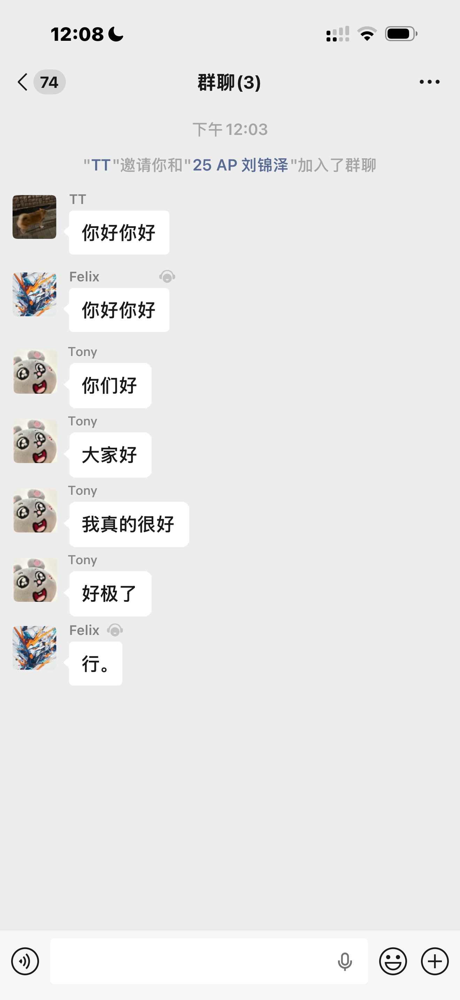

# Chat Screenshot Mirroring Tool

一个基于 OpenCV / NumPy / Pillow 的聊天截图重排原型。

它的主要功能是：

- 识别右侧绿色聊天气泡
- 识别对应头像
- 将聊天对象镜像到左侧
- 将绿色气泡重绘为白色气泡
- 可选在头像上方添加昵称

当前代码更接近“可工作的算法原型”，而不是完整产品。公开仓库默认只保留核心实现和展示资源；本地调试时用到的大量 `test_*` / `debug_*` / `measure_*` 脚本没有一并公开。

## 效果展示

<table>
  <tr>
    <td align="center">
      <strong>真实参考图：单人</strong><br/>
      
    </td>
    <td align="center">
      <strong>生成结果：单人</strong><br/>
      
    </td>
  </tr>
  <tr>
    <td align="center">
      <strong>真实参考图：多人连续消息</strong><br/>
      
    </td>
    <td align="center">
      <strong>生成结果：多人连续消息</strong><br/>
      
    </td>
  </tr>
  <tr>
    <td align="center" colspan="2">
      <strong>生成结果：带昵称</strong><br/>
      
    </td>
  </tr>
</table>

也可以直接打开 [compare.html](compare.html) 做本地对比查看。

## 核心流程

主入口在 [`main.py`](main.py)。

算法大致分成 4 步：

1. 使用 HSV 阈值检测右侧绿色聊天气泡。
2. 在气泡附近搜索头像，并提取头像可见区域。
3. 擦除原始头像和气泡区域，用背景 patch 回填。
4. 将头像和气泡镜像到左侧，同时重绘白色气泡；若开启昵称，则在消息组首条上方绘制昵称。

为了避免气泡整体翻转后出现反字，代码会单独提取原气泡内文字区域，并在镜像后的气泡上重新贴回可读内容。

## 运行环境

- Python 3.10+
- macOS 推荐

主要依赖：

- `opencv-python`
- `numpy`
- `Pillow`

安装示例：

```bash
python3 -m venv .venv
source .venv/bin/activate
pip install opencv-python numpy Pillow
```

说明：

- 昵称模式默认优先使用 macOS 系统字体路径，中文昵称在 macOS 上效果更稳定。
- 如果找不到对应字体，ASCII 文本会退回到 OpenCV 文本绘制，效果会差一些。

## 用法

不加昵称：

```bash
python3 main.py nonickname TEST.PNG output/result.png
```

加昵称：

```bash
python3 main.py yesnickname Tony TEST.PNG output/result_with_name.png
```

也支持最简参数形式：

```bash
python3 main.py TEST.PNG output/result.png
```

程序运行后会在终端输出一些诊断信息，例如：

- 中线位置
- 检测到的气泡数量
- 检测到的头像数量
- 是否启用昵称模式

## 仓库结构

```text
.
├── main.py                  # Python 主实现
├── C++/main.cpp             # C++ 对照实现
├── real_example/            # 参考效果图
├── output/                  # 示例输出图
├── compare.html             # 本地效果对比页
├── LICENSE
├── .gitignore
└── README.md
```

## 当前限制

- 参数明显偏向某一类聊天截图样式，尤其是“右侧绿色气泡 + 浅灰背景”。
- 背景修补不是通用修复，而是从原图中找一块平整区域后模糊铺回。
- 昵称排版目前是启发式规则，不是完整的字体测量与版式系统。
- 本地实验脚本和校准脚本未纳入公开仓库，也不构成正式测试体系。

## 版本说明

- `main.py` 是当前主要维护版本。
- `C++/main.cpp` 保留了更完整的早期实现思路，适合作为算法对照参考。

## 后续可改进方向

- 增加 `requirements.txt` 和更明确的环境说明
- 将 `main.py` 拆分成检测、重建、排版等模块
- 提供批处理命令行接口
- 引入真实测试样例和回归测试
- 将硬编码的字体路径改成可配置项
